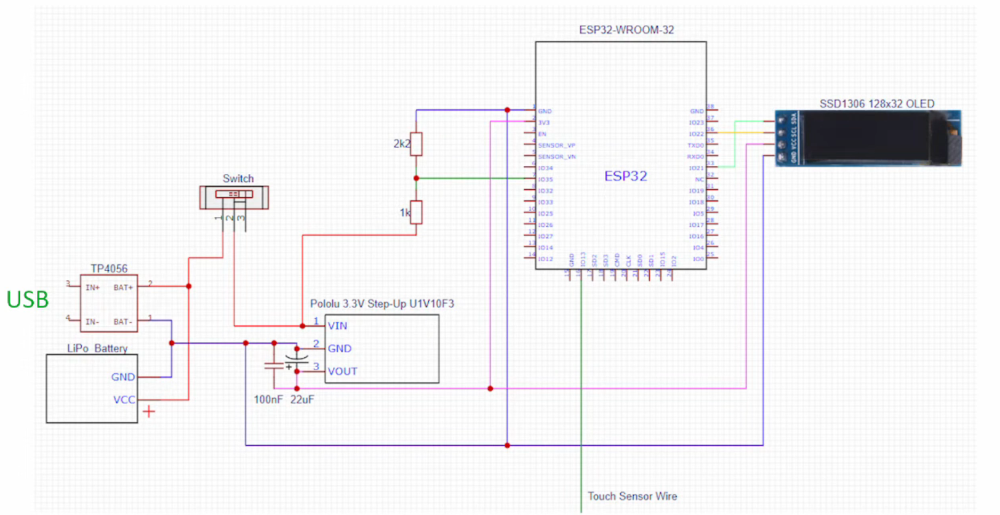

# ESP32 Smart Glasses

  
*Schematic diagram of the ESP32 Smart Glasses*

A wearable display system using ESP32 with BLE/WiFi connectivity and OLED display. Designed for low-power operation with touch controls.

## Features

- **Dual-mode operation**:
  - BLE mode for normal operation (30mA)
  - Web Update mode for OTA firmware updates (140mA peaks)
- **Power management**:
  - Configurable power save intervals
  - Deep sleep capability
  - Battery monitoring
- **OLED display**:
  - 128x32 resolution
  - Multiple screen layouts (time, notifications, navigation, etc.)
  - Custom fonts and symbols
- **Touch controls**:
  - Configurable GPIO and threshold
  - Supports single/multi-click and long-press
- **Wireless connectivity**:
  - BLE for smartphone communication
  - WiFi for OTA updates

## Hardware Requirements

- ESP32 development board
- SSD1306 128x32 OLED display (I2C)
- Touch sensor (capacitive)
- LiPo battery with charging circuit
- Optional: Voltage divider for battery monitoring

## Pin Configuration

| Function           | GPIO | Notes                          |
|--------------------|------|--------------------------------|
| OLED SDA           | SDA  | I2C data                       |
| OLED SCL           | SCL  | I2C clock                      |
| Touch Sensor       | 4    | Configurable in code           |
| Battery Monitoring | 35   | Through voltage divider        |

## Installation

1. Clone this repository
2. Open in Arduino IDE or PlatformIO
3. Install required libraries:
   - U8g2 (OLED)
   - BLE (for BLE mode)
   - WiFi/WebServer (for OTA updates)
4. Upload to ESP32

## Configuration

Modify these constants in the code as needed:

```cpp
#define BLE_NAME "ESP32 (SmartGlasses)"
#define TOUCH_SENSOR_GPIO 4
#define TOUCH_SENSOR_THRESHOLD 15
#define POWER_SAVE_INTERVAL 8000
#define BATTERY_VOLTAGE_FLAT 3.1f
```

## Usage

### BLE Mode (Default)
1. Power on the device
2. Connect via BLE from your smartphone
3. Send commands in format: `#SCREEN|DATA1|DATA2|...`
   - Example: `#0|1|15:40|2023-06-01|260|24'C` (main screen)

### Web Update Mode
1. Press touch sensor for 5+ seconds to switch modes
2. Connect to WiFi "NewWifi" (password: 123456789)
3. Access web interface at assigned IP
4. Upload new firmware

### Touch Controls
- Single click: Send action to connected device
- Double click: Custom action
- Long press (5s): Switch to Web Update mode

## Power Management

The device features several power-saving measures:
- OLED auto-off after configurable interval
- Deep sleep when battery is critical
- BLE/WiFi radio management

## Troubleshooting

- **Can't reconnect after BLE disconnect**: Known ESP32 BLE limitation - device automatically reboots
- **OLED not working**: Check I2C connections and reset timing (some displays need 3s boot delay)
- **Touch sensor too sensitive**: Adjust `TOUCH_SENSOR_THRESHOLD` in code

## License

MIT License - Free for personal and commercial use

```